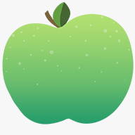

# Cronch

Ever had a 5-minute break turned into an hour-long trip down the YouTube rabbit hole? CRONCH is here to help you take control of your free time! Our mission is to help you cultivate the time management skills that are necessary for success.

Cronch's mission is to help students build long-term time management skills while providing faculty quantitative data to make better-informed decisions.

Available on the [App Store](https://itunes.apple.com/app/id1453301936) and [Google Play](https://play.google.com/store/apps/details?id=app.cronch.cronch)

# Features

## BATTLE PLAN
- Make a plan, then follow through with it
- Pull from your Canvas feed, or insert your own custom tasks

## TIMER

- Track how long it takes for you to complete your homework
- Activate the timer only when your phone is face-down to avoid any distractions
- Add alarms for work/break Pomodoro intervals

## ANALYTICS

- See where you’re allocating your time
- Check how long your breaks really are
- Other analytical features coming soon!

## MyMICDS.net INTEGRATION

- Cronch is powered by yours truly, MyMICDS.net
- Login with your MyMICDS.net account to pull your homework from Canvas

And don’t forget that Cronchy the apple is always there to cheer you on through a hard assignment!

# Repo Structure

[Cronch Mobile](https://github.com/nickbclifford/Cronch/tree/master/expo) - The mobile app for students.

[Cronch Backend](https://github.com/nickbclifford/Cronch/tree/master/backend) - Storing timeslots and other data for the Cronch platform.

[Cronchalytics](https://github.com/nickbclifford/Cronch/tree/master/web-teachers) - Giving teachers quantitative data so that they can make better-informed decisions—from planning nightly homework to even full courses.

[Logo](https://github.com/nickbclifford/Cronch/tree/master/logo) - Assets for Cronch's logo that do not belong in any of the apps (Ex. App Store icon)

# Hackathon

The MICDS team won third place out of 19 schools. We won $2,500 to improve our school's STEM program!

## Team

Cronch was made with the hard work of:

- Jack Cai (2019)
- Nick Clifford (2020)
- Rafael Francisco Gil Diaz (2019)
- Michael Gira (2019)
- Jack Lee (2019)
- Alex Migala (2020)
- Emma Nohara-LeClair (2019)
- Sophia Puertas (2019)
- Andrew Zhao (2019)

Special thanks for the guidance of our WWT mentors Kelsey Knoke and Chinmay Samal!

Last but certainly not least, many thanks to our faculty sponsors Mrs. Purdy and Mr. Borja!

